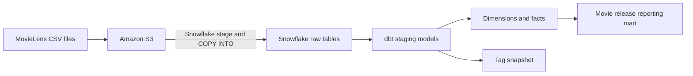

# AWS S3 → Snowflake → dbt Data Transformation Pipeline

An ELT pipeline for MovieLens movie, rating, and tag data. CSV data is ingested into **Amazon S3**, loaded into **Snowflake**, and then transformed using **dbt** into staging models, dimensions, fact tables, and a reporting mart.



## Pipeline

1. Upload `movies.csv`, `ratings.csv`, `tags.csv`, `links.csv`, `genome-tags.csv`, and `genome-scores.csv` to an S3 bucket.
2. Configure a Snowflake external stage for the bucket and load the CSV files into raw tables with `COPY INTO`.
3. Run dbt to standardize columns, clean movie and tag labels, build dimensions and facts, and test the resulting data.

S3 upload and Snowflake ingestion are setup steps performed outside dbt. The repository contains SQL setup notes and the dbt transformation project; it does not provision AWS infrastructure or schedule ingestion.

## Repository structure

```text
instructions.sql                 # Snowflake setup, loading, and local setup notes
my_dbt_project/
├── dbt_project.yml
├── models/
│   ├── staging/                 # Source column names and timestamp conversion
│   ├── dim/                     # Movie, user, and genome tag dimensions
│   ├── fact/                    # Ratings and genome relevance scores
│   ├── mart/                    # Ratings enriched with release-date availability
│   └── schema.yml               # Model descriptions and data tests
├── seeds/                       # Movie release dates
└── snapshots/                   # Tag history snapshot
```

## Transformations

| Layer | Models and behavior |
| --- | --- |
| Staging | Six models read raw tables, rename columns, and convert rating/tag timestamps. Most are views; ratings and tags are tables. |
| Dimensions | `dim_movies` cleans titles and splits genres into arrays; `dim_users` combines users from ratings and tags; `dim_genome_tags` cleans tag names. |
| Facts | `fct_ratings` excludes null ratings and incrementally loads records newer than the existing maximum timestamp. `fct_genome_scores` keeps positive relevance scores and rounds them to four decimal places. |
| Enrichment | `dim_movies_with_tags` is an ephemeral join of movies, tags, and relevance scores. |
| Mart | `mart_movie_releases` joins ratings to seeded movie release dates and flags whether release information is available. |
| Snapshot | `snap_tags` uses a timestamp strategy to track tags. The current query is limited to 100 rows. |

## Getting started

### 1. Prepare S3 and Snowflake

Upload the six CSV files to your S3 bucket. Review `instructions.sql` and execute the relevant Snowflake statements in a worksheet. It also contains shell commands and configuration notes, so it is not intended to run as one SQL script. Replace the example bucket and credential placeholders with your own local configuration. Keep credentials out of Git.

**Source schema:** the checked-in staging models read `MOVIELENS.PUBLIC.RAW_*`, while the loading notes select `MOVIELENS.RAW`. Before loading, align the ingestion schema with the models: use `PUBLIC` for the raw tables, or update the six staging references to the schema where you load them. The dbt profile's output schema can remain `RAW`; it is independent of the source schema.

The dbt role needs warehouse usage, database/schema usage, `SELECT` on source tables, and permissions to create tables and views in its output schema. Snapshot execution also requires access to the configured `snapshots` schema.

### 2. Install dbt

With a compatible Python installation, create and activate a virtual environment, then install the Snowflake adapter:

```powershell
python -m venv .venv
.\.venv\Scripts\Activate.ps1
python -m pip install dbt-snowflake
cd my_dbt_project
```

### 3. Configure the connection

Create a `my_dbt_project` profile in your local `~/.dbt/profiles.yml` (`%USERPROFILE%\.dbt\profiles.yml` on Windows). Configure your Snowflake account, user, supported authentication method, `TRANSFORM` role, warehouse, `MOVIELENS` database, and output schema. Keep this file outside the repository.

```powershell
dbt debug
```

### 4. Install the snapshot dependency

The snapshot calls `dbt_utils.generate_surrogate_key`. The current project does not include a package manifest. Before parsing or building the full project, add a compatible version of `dbt-labs/dbt_utils` to `my_dbt_project/packages.yml` and run:

```powershell
dbt deps
```

### 5. Build and test

```powershell
dbt seed
dbt run
dbt test
dbt snapshot
```

`schema.yml` includes not-null checks and a relationship test from ratings to movies. Uniqueness checks are currently commented out. The incremental ratings model assumes incoming records have timestamps newer than the current maximum; late-arriving or corrected records need separate handling. Remove or revise the snapshot's `LIMIT 100` before using it to track the complete tag dataset.

To generate model documentation:

```powershell
dbt docs generate
dbt docs serve
```

## Local files

Virtual environments, dbt logs, compiled artifacts, downloaded packages, profiles, and credential files are excluded from version control. Source CSV uploads and Snowflake credentials are not included.
